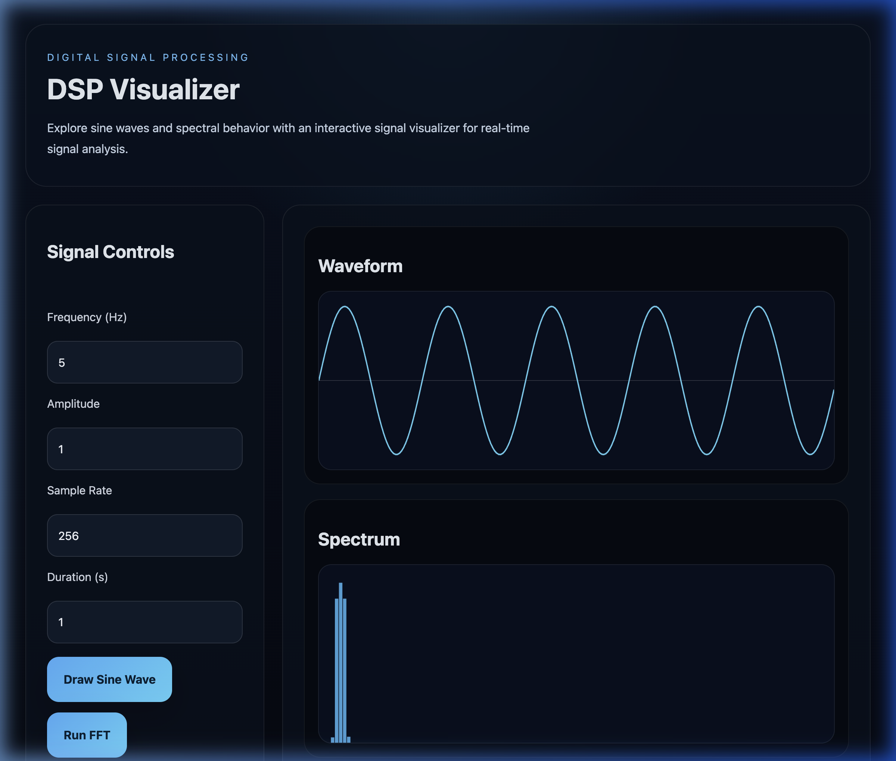
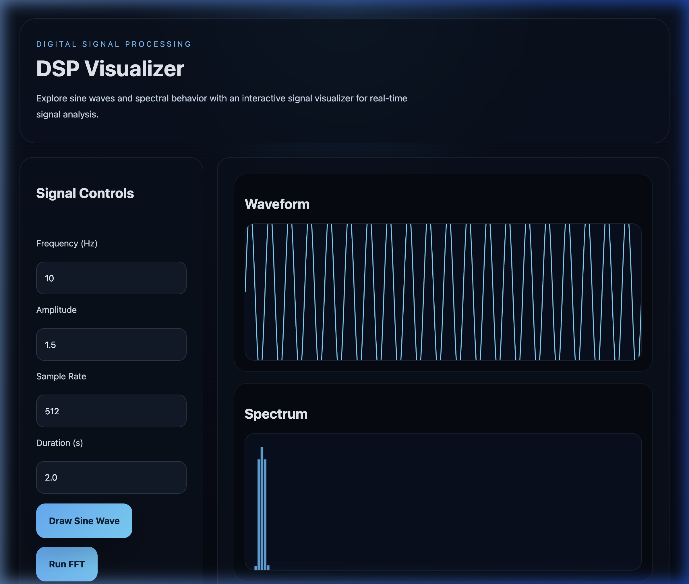
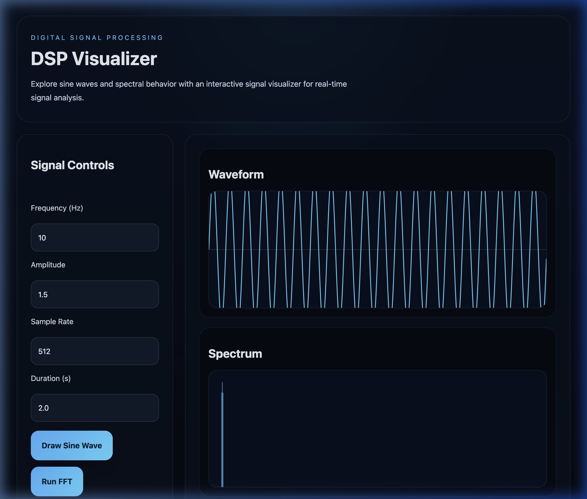
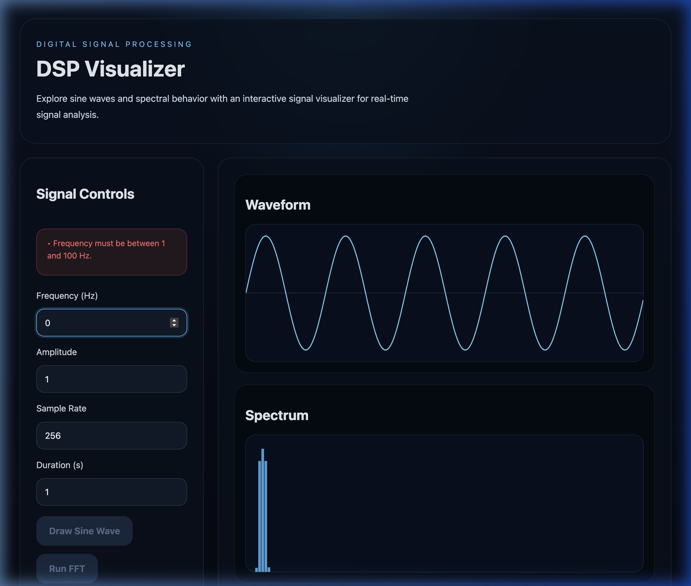
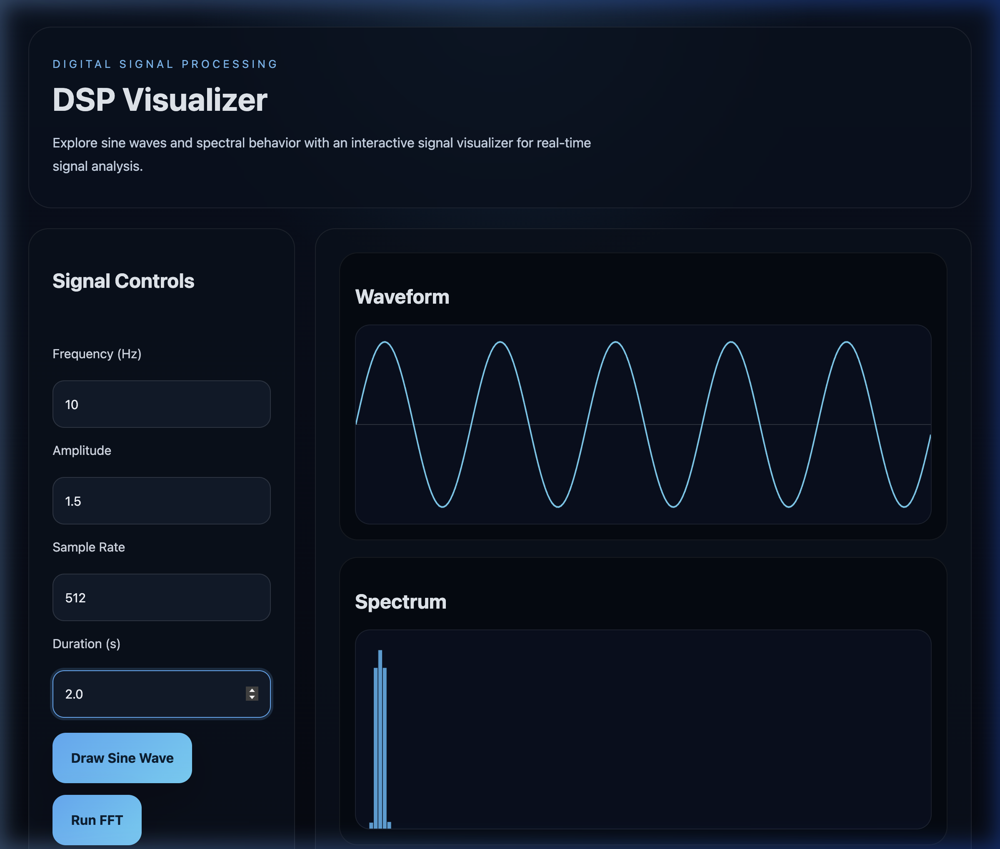
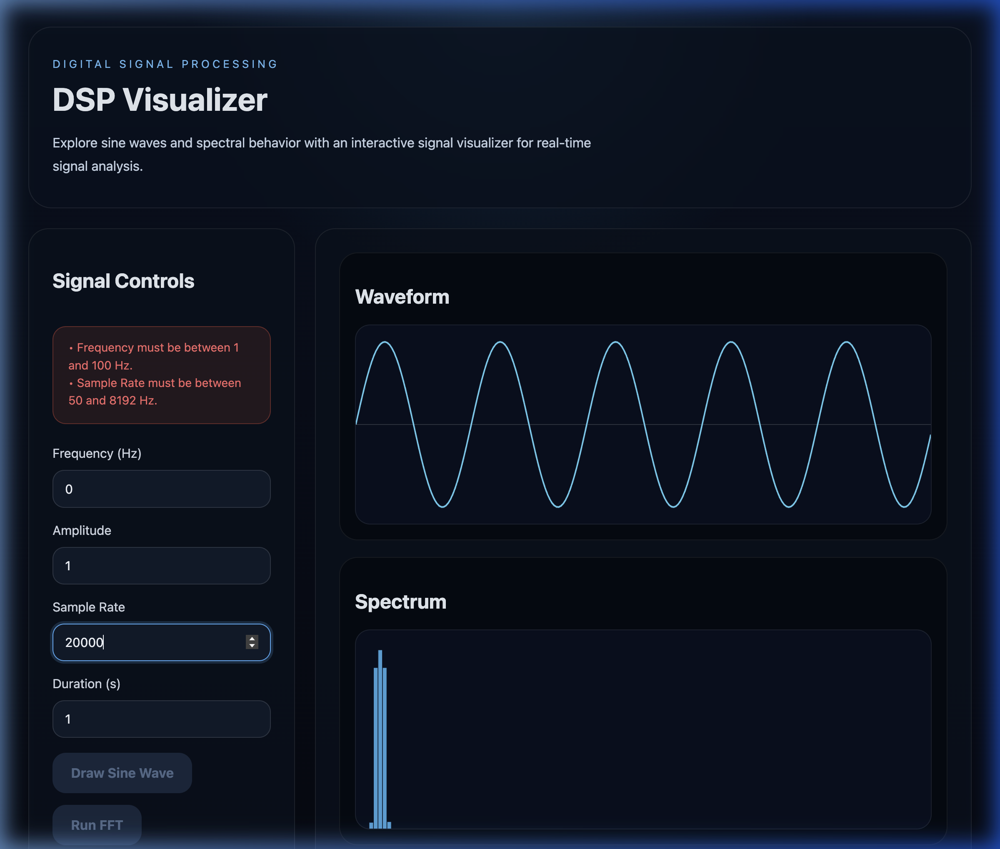
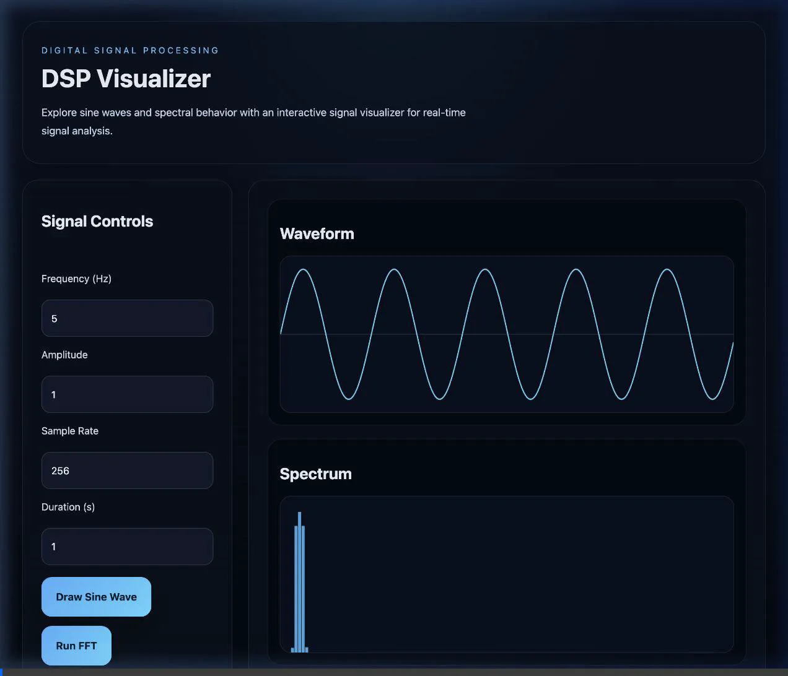

# DSP Visualizer: High-Performance Signal Analysis Tool

A high-performance interactive web application for generating, windowing, and analyzing digital signals in both time and frequency domains in real time.

[](https://github.com/Gauthyyy/dsp-visualizer/actions)

---

## Project Walkthrough

Explore the visual capabilities, interactive validation states, and rendering pipelines of the DSP Visualizer:

| Initial Dashboard | Waveform Generation |
| :---: | :---: |
|  <br> *Default UI state on load with preset inputs.* |  <br> *Time-domain sine wave rendering.* |

| FFT Analysis | Frequency Analysis (Validation Warning) |
| :---: | :---: |
|  <br> *FFT spectrum analysis with dB scaling.* |  <br> *Real-time validation error for frequency parameter.* |

| Error Recovery State | Sample Rate Configuration |
| :---: | :---: |
|  <br> *Automatic error clearance and action button release.* |  <br> *High sample-rate setup validation error limits.* |

### Automated Verification Output

*Interactive browser-driven automated verification pipeline testing user-flows, errors, and rendering checks.*

---

## Technical Highlights

The DSP Visualizer has been optimized at the compiler and memory level to deliver smooth, stutter-free performance:

*   **Radix-2 Cooley-Tukey FFT Optimization**:
    *   **Twiddle Factor Tables**: Eliminates $O(N \log N)$ trigonometric function calls during runtime by precomputing and caching complex twiddle tables (`cosTable` and `sinTable`) for every power-of-two size $N$. 
    *   **Bit-Reversal Index Cache**: Bypasses dynamic index calculation loops and bitwise operations by maintaining a cache of swapped index pairs (`swappers`), looping only over elements requiring mutation.
*   **Hann Window Coefficients Caching**:
    *   Caches Hann window coefficients for signal duration $L$ in `hannCache`. The signal windowing loop performs zero `Math.cos` operations at runtime, changing the step time from $O(L)$ trig calculations to $O(L)$ basic array multiplications.
*   **Zero-Allocation Pipeline (Typed Arrays)**:
    *   Transitioned the signal generator and spectral loops from native JavaScript arrays and conversion operations (such as `Array.from()`) to raw `Float64Array` typed arrays. This eliminates heap garbage accumulation, reducing Garbage Collector pauses.
*   **Highly Efficient Rendering Loops**:
    *   Replaced high-level JavaScript iterators (`.forEach()`) in canvas drawing operations with standard index-based `for` loops to bypass function closure instantiation on every redraw.
    *   Replaced spread operators (e.g. `Math.max(...magnitudes)`) with linear search iterations, avoiding JavaScript engine stack size limit thresholds on large signal sets.
*   **Automated Verification & FFT Peak-Accuracy Testing**:
    *   Includes a command-line test runner (`npm test`) that synthesizes a pure tone, processes it through the Optimized Radix-2 FFT, and asserts that the detected peak bin matches the expected tone parameter within grid resolution limits.

---

## Installation & Usage

Follow these steps to run the application locally:

### 1. Prerequisites
Ensure you have [Node.js](https://nodejs.org/) installed (v18 or higher is recommended).

### 2. Setup
Clone the repository and install the development dependencies:
```bash
cd dsp-visualizer
npm install
```

### 3. Running the Dev Server
Launch the local Vite development server:
```bash
npm run dev
```
Open the printed local URL (typically `http://localhost:5173/`) in your browser to interact with the visualizer.

### 4. Running the Tests
Run the automated mathematical correctness checks for the Radix-2 FFT:
```bash
npm test
```

### 5. Production Compilation
Bundle the application assets for static hosting (outputs to the `/dist` directory):
```bash
npm run build
```